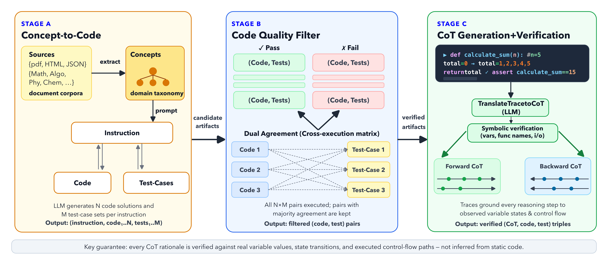

# Think Like You Execute: Verifiable Chain of Thought from Program Traces

<!-- > *Shailja Thakur, Vaibhav Saxena, Rohan Kulkarni, Shivdeep Singh, Parameswaran Selvam, Hiroshi Kanayama, Hima Patel*   -->
> **IBM Research**

---

This repository contains the **Verified Code CoT** data synthesis pipeline — an end-to-end system that generates execution-grounded chain-of-thought training data for code reasoning. Each reasoning sample is verified against actual program execution traces, not generated from static code.

<p align="center">
  
</p>

---

## What's in this repo

| Path | Description |
|---|---|
| `examples/run_demo.py` | End-to-end pipeline runner (all stages) |
| `examples/test_concepts.txt` | Sample seed input |
| `pipeline_config.yaml` | All configurable knobs |
| `src/dataops_code_cot/components/` | Stage A + B core logic |
| `src/dataops_code_cot/scripts/` | Stage C scripts (traces, CoT generation, verification) |
| `COT_PIPELINE_GUIDE.md` | Full stage-by-stage guide |

---

## Setup

```bash
. ./setenv.sh
uv pip install -e .
```

`setenv.sh` creates the virtual environment and installs dependencies. `uv pip install -e .` installs the `dataops_code_cot` package. Run both once before anything else.

## Quick Start

```bash
python examples/run_demo.py --input-file examples/test_concepts.txt
```

Model backend and all other settings are read from `pipeline_config.yaml`. Override on the command line if needed:

```bash
python examples/run_demo.py \
  --input-file examples/test_concepts.txt \
  --backend ollama \
  --model-id llama3.1:8b \
  --output-dir /tmp/codecot_run
```

**Output:** CoT data → `<output-dir>/raw/filtered/` · Summary → `<output-dir>/demo_report.md`

Supported backends: `ollama` · `openai-compatible`

---

## Pipeline

**Stage A — Concept-driven synthesis.** Extract programming concepts from seed text. For each concept, generate natural language instructions across difficulty levels, derive typed function signatures, and produce candidate code solutions with assert-style test cases.

**Stage B — Execution-based quality filter.** Execute all solution–test combinations in a sandboxed environment. Cluster solutions by identical pass/fail patterns and score each cluster using dual-agreement consensus (`|C| × |T_p|`). Only high-consensus pairs are retained.

**Stage C — Execution-grounded CoT generation and verification.** Instrument retained solutions with PySnooper to capture execution traces (variable states, transitions, control flow). Prompt an LLM to generate forward reasoning (input → output) and backward reasoning (output → input), both grounded in the trace. Each rationale is verified using a sliding-window entity-matching algorithm — rationales whose claimed variable values or control flow diverge from the trace are discarded.

---

## Configuration

Edit `pipeline_config.yaml` to control concept cap, difficulty level, number of samples, test case limits, trace counts, and CoT pair budget — no flags needed.

> **Note on model choice:** Models that follow structured prompts reliably (e.g. `llama3.1:8b`, `nemotron`, Mistral-family) work best. Thinking models (Qwen3, DeepSeek-R1) require `max_output_tokens: 4096` or higher in `pipeline_config.yaml`. Very small models (< 3B) may not follow the output format consistently.

For running at scale and understanding each stage in detail, see [COT_PIPELINE_GUIDE.md](./COT_PIPELINE_GUIDE.md).

---

## Citation

```bibtex
@inproceedings{thakur2025verified,
  title     = {Think Like You Execute: Verifiable Chain of Thought from Program Traces},
  author    = {Thakur, Shailja and Saxena, Vaibhav and Kulkarni, Rohan and
               Singh, Shivdeep and Selvam, Parameswaran and Kanayama, Hiroshi and Patel, Hima},
  booktitle = {Proceedings of the 63rd Annual Meeting of the Association for Computational Linguistics (Industry Track)},
  year      = {2026},
}
```
